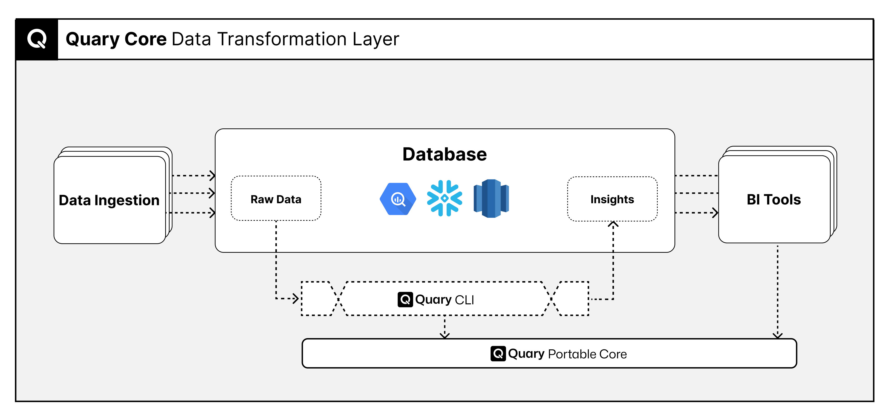

<p align="center">
  <a href="https://quary.dev">
    <picture>
      
    </picture>
    <h1 align="center">quary</h1>
  </a>
</p>
<p align="center">
  <a aria-label="Quary logo" href="https://www.quary.dev/">
    
  </a>
  <a aria-label="Slack community" target="_blank" href="https://join.slack.com/t/quarylabs/shared_invite/zt-2dlbfnztw-dMLXJVL38NcbhqRuM5gUcw">
    
  </a>
  <a aria-label="License" href="https://github.com/quarylabs/quary/blob/main/LICENSE">
    
  </a>
</p>



## What is Quary?

Quary enables teams to design, document, test and deploy data transformations to your SQL data stores. Quary is a SQL
engine and CLI tool that lets you manage your data transformation projects with ease.

Teams use Quary to transform their raw data tables into actionable and trustworthy insights. Teams do so by layering
well documented and tested transformations into useful insights ready for consumption. A Quary project is formed of a
collection of these SQL `SELECT` statements, that build on top of each other.

- Visit [our website](https://www.quary.dev) to learn more
- Visit [our documentation](https://www.quary.dev/docs) to learn how to use Quary

## Getting Started

### Installation

The following Quary repository contains the core Quary library as well as the Quary CLI tool. The Quary CLI tool can be
installed as following

#### Homebrew installation for macOS

Quary can be installed using Homebrew on macOS using the following command:

```
brew install quarylabs/quary/quary
```

#### Linux/Mac through curl

Quary can be installed using curl on Linux/Mac using the following command:

```shell
curl -fsSL https://raw.githubusercontent.com/quarylabs/quary/main/install.sh | bash
```

#### Other installations

Other builds are available in the [releases page](https://github.com/quarylabs/quary/releases/latest) to download.

### Usage

Once installed, a sample project can be created and run as follows:

```shell
mkdir example # create an empty project folder
cd example
quary init    # initialize DuckDB demo project with sample data
quary compile # validate the project structure and model references without database
quary build   # build and execute the model views/seeds against target database
quary test -s   # run defined tests against target database
```

Note that you will most likely want to use
our [Visual Studio Code extension](https://marketplace.visualstudio.com/items?itemName=Quary.quary-extension) to
visualise the project.

## Support

If you run into any problems using Quary, please let us know. We want Quary to be easy-to-use, so if you are getting
confused, it is our fault, not yours. [Create an issue](https://github.com/quarylabs/quary/issues) and we'll be happy to
help you out.
