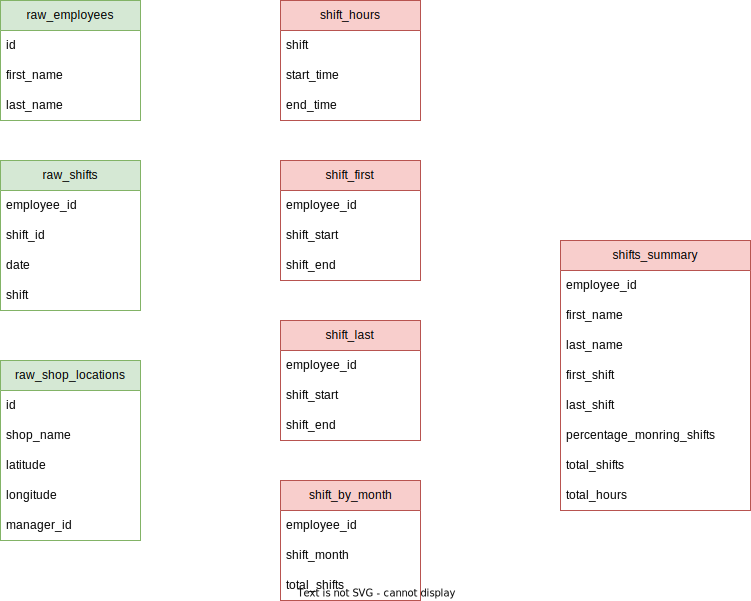

# Sample Quary Project

Welcome to Quary's example/sample repository! This repository is aimed at getting you started by showing you some of the basic features.

The project illustrates some simple data of a shop with a few stores and with individuals working shifts in them. The following tables illustrate the relationship between seeds, models and sources. For more information about these visit the [docs](https://quary.dev/docs).

## Data Model

The example is based upon the following data model, where the green tables are seeds and the red tables are models.



## Visual Studio Code Run Through

This example takes you down the path of using the Visual Studio Code extension, but it can be equally done with a CLI tool.

In this demonstration, you will:

1. Clone the repository
2. Opening the project and installing the extension
3. Run the models and tests
4. Render the tables and views
5. Quickly render a model
6. Add a separate table to the database and a and source to the project

### Cloning the repository

This repository is a template, so use the `Use this template` button to create button to clone it.

### Opening the project and installing the extension

Once you have cloned the repository you can open in a in-browser instance of VS Code. You can do this by using the period shortcut `.`.

This should open a VS Code instance in your browser at `github.dev/<your-username>/<project-name>`.

Once there, you can install the extension by either:

- Clicking the `Install` button in the bottom right corner, when VS Code asks you to install recommended extensions
- Clicking on the extensions icon and installing the extensions from there in the `Recommended` tab

### Running the models and tests

Once you have the extension installed, you can run the models and tests by using the command palette which can be opened with `Cmd + Shift + P` or `Ctrl + Shift + P`. The commands are:

- `QUARY: Run` to run all the models
- `QUARY: Test` to run all the tests

Note:

- When running Quary for the first time, VSCode will ask you which database configuration to use, for this demo use `sqlite-in-browser`.
- For the tests to run successfully, you need to run the models first to put them in the database first.

### Render the tables and views

Showing the tables and views in the database can be done with the `QUARY: Render Tables` commands.

### Quickly render a model

When developing it is useful to be able to quickly render models, for this use the `QUARY: Render Model` command. This will prompt you with the model you wish to render and then render the chosen model.

### Add a separate table to the database and a and source to the project

To add a table, use the `QUARY: Statement` command which allows arbitrary SQL statements to be run against the database

```sql
CREATE TABLE IF NOT EXISTS employee_band_table (employee_id INTEGER, band_id INTEGER);
```

You should be able to see it if you render the tables with `QUARY: Render Tables`.

To add a source, create a new project file and add the following definition to it

```yaml
sources:
  - name: employee_band
    path: employee_band_table
```

This source can now be used in models and tests.

## Data generation method

The seeds represent fake data for 10 individuals and 4 stores. The data for raw_shifts was generated using the following script.

```go
package main

import (
	"fmt"
	"math/rand"
	"time"
)

type Shift struct {
	EmployeeID int
	StoreID    int
	Date       time.Time
	Shift      string
}

func main() {
	rand.Seed(42)

	// Start from the beginning of 2022
	startDate := time.Date(2022, time.January, 1, 0, 0, 0, 0, time.UTC)
	// End at the end of June 2022
	endDate := time.Date(2022, time.July, 1, 0, 0, 0, 0, time.UTC)

	// shifts is a slice of Shifts
	var shifts []Shift

	// For the managers (1-4) they work Monday to Friday every week, morning and afternoon
	// Iterate over the days
	managersToStore := map[int]int{
		4: 1,
		5: 2,
		6: 3,
		7: 4,
	}
	for manager, store := range managersToStore {
		for d := startDate; d.Before(endDate); d = d.AddDate(0, 0, 1) {
			// Check if the day is Monday to Friday
			if d.Weekday() >= time.Monday && d.Weekday() <= time.Friday {
				// Print the date in day-month-year format
				shifts = append(shifts, Shift{manager, store, d, "morning"})
				shifts = append(shifts, Shift{manager, store, d, "afternoon"})
			}
		}
	}

	// For the employees (5-10) they work 3 days a week, morning and afternoon
	// Iterate over the days
	employeesToStoreThatWorkIn := map[int][]int{
		1:  []int{1},
		2:  []int{2, 3},
		3:  []int{4, 1, 2},
		8:  []int{3, 4},
		9:  []int{2},
		10: []int{1},
	}
	for employee, stores := range employeesToStoreThatWorkIn {
		// Iterate over the days
		for d := startDate; d.Before(endDate); d = d.AddDate(0, 0, 1) {
			// is weekday
			if d.Weekday() >= time.Monday && d.Weekday() <= time.Friday {
				// Do a 3/5 chance of working on the day
				isWorkingMorning := rand.Intn(5) < 3
				isWorkingAfternoon := rand.Intn(5) < 3
				// Pick one of the stores at random of that employee
				store := stores[rand.Intn(len(stores))]
				if isWorkingMorning {
					shifts = append(shifts, Shift{employee, store, d, "morning"})
				}
				if isWorkingAfternoon {
					shifts = append(shifts, Shift{employee, store, d, "afternoon"})
				}
			}
		}
	}

	csv := "employee_id,store_id,date,shift\n"
	for _, shift := range shifts {
		csv += fmt.Sprintf("%d,%d,%s,%s\n", shift.EmployeeID, shift.StoreID, shift.Date.Format("2006-01-02"), shift.Shift)
	}
	fmt.Println(csv)
}
```
